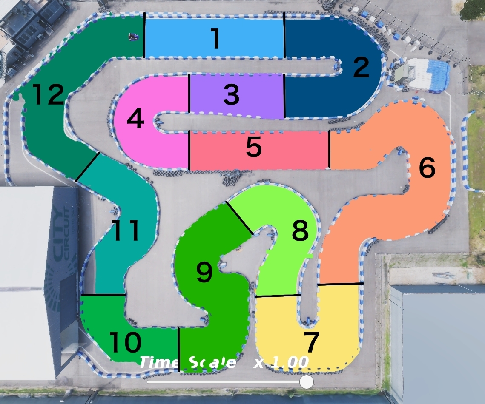

# section_timer

## section_timer_node

このNodeは、AIチャレンジ2024の決勝準備において、セクションごとのタイムを計測するためのものである。

### Input topics

| Name            | Type                        | Description         |
|-----------------|-----------------------------|---------------------|
| `~/input/odom`  | nav_msgs::msg::Odometry     | vehicle position    |

### Output topics

| Name                     | Type                                  | Description                                                           |
|--------------------------|---------------------------------------|-----------------------------------------------------------------------|
| `~/output/section_times` | std_msgs::msg::Float32MultiArray      | Array containing the times for each section and the total lap time.   |

**Details of `data` array:**
- `data[0]` to `data[11]`: Time taken to complete each respective section of the race track.
- `data[12]`: Total time taken to complete one lap.

### Map

